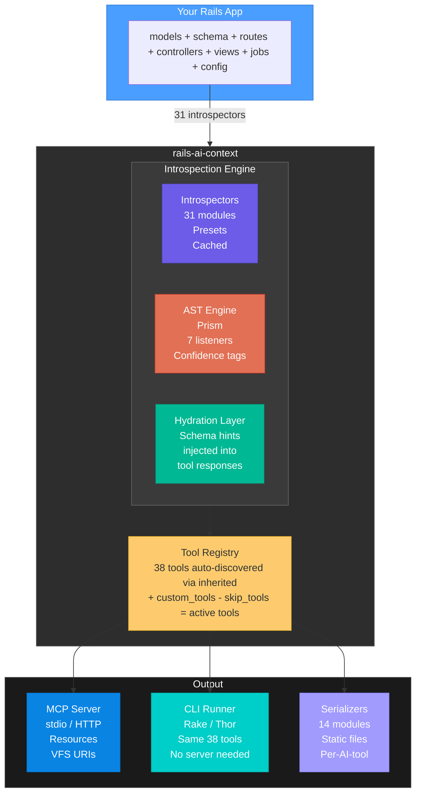
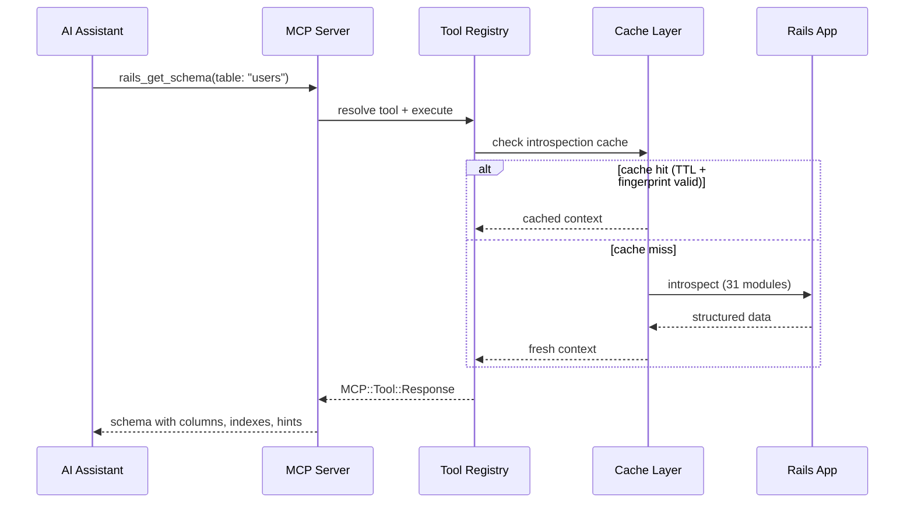
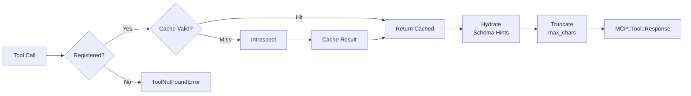

<div align="center">

# Architecture

**How rails-ai-context is built, and why.**

[Tools Reference](TOOLS.md) · [Introspectors](INTROSPECTORS.md) · [Security](SECURITY.md) · [Custom Tools](CUSTOM_TOOLS.md)

</div>

---

## System overview



### Data flow



### Request lifecycle



## Core modules

### Introspectors (`lib/rails_ai_context/introspectors/`)

31 modules that extract structured data from your Rails app. Each introspector:

- Returns a Hash (never raises — wraps errors in `{ error: msg }`)
- Is registered in `INTROSPECTOR_MAP` with a symbol key
- Belongs to one or both presets (`:standard`, `:full`)
- Results are cached with TTL + fingerprint invalidation

The `Introspector` orchestrator runs configured introspectors and merges results.

### AST Engine

**Prism AST parsing** replaced all regex-based Ruby source parsing in v5.2.0.

- **AstCache** — Thread-safe parse cache (`Concurrent::Map`), keyed by path + SHA256 + mtime
- **SourceIntrospector** — Single-pass Prism Dispatcher walks the AST once, feeds events to all 7 listeners simultaneously
- **7 Listeners** — Associations, Validations, Scopes, Enums, Callbacks, Macros, Methods
- **Confidence** — Every result carries `[VERIFIED]` (static literals) or `[INFERRED]` (dynamic expressions)

### Tool Registry (`lib/rails_ai_context/tools/base_tool.rb`)

Auto-registration via Ruby's `inherited` hook:

1. `BaseTool.inherited(subclass)` fires when any file in `tools/` defines a subclass
2. Subclass is appended to `@descendants` (protected by `@registry_mutex`)
3. `BaseTool.registered_tools` eager-loads all tool files and returns non-abstract classes
4. `BaseTool` itself is marked `abstract!` — excluded from the registry

**Deadlock-free design**: `eager_load!` collects constants to load inside the mutex, loads them outside (because `const_get` triggers Zeitwerk autoloading which calls `inherited` which needs the mutex), then sets the flag inside the mutex.

### MCP Server (`lib/rails_ai_context/server.rb`)

Built on the official `mcp` Ruby SDK:

- **Transports**: stdio (default) or HTTP (Streamable HTTP via `MCP::Server::Transports::StreamableHTTPTransport`)
- **Tools**: all active tools (builtin + custom − skip_tools)
- **Resources**: 9 static resources + 5 dynamic VFS resource templates
- **Instrumentation**: bridges to `ActiveSupport::Notifications`
- **Live Reload**: watches files, invalidates caches, notifies clients

### VFS (`lib/rails_ai_context/vfs.rb`)

Virtual File System for `rails-ai-context://` URIs:

```
rails-ai-context://models/Post         → model details + schema
rails-ai-context://controllers/Posts   → actions, filters, params
rails-ai-context://controllers/Posts/index → action source
rails-ai-context://views/posts/show.html.erb → template content
rails-ai-context://routes/posts        → filtered routes
```

Every resolve call introspects fresh — zero stale data.

### Hydration Layer (`lib/rails_ai_context/hydrators/`)

Cross-tool semantic hydration (v5.3.0):

- **ControllerHydrator** — Parses controller source via Prism AST to detect model references, injects schema hints
- **ViewHydrator** — Maps `@post` → `Post` by convention, injects schema hints
- **SchemaHintBuilder** — Resolves model names to `SchemaHint` value objects from cached context
- **HydrationFormatter** — Renders hints as compact Markdown sections

Result: controller and view tools automatically include relevant schema information without extra tool calls.

### Serializers (`lib/rails_ai_context/serializers/`)

14 modules that format introspection output for different AI tools:

| Serializer | Output |
|:-----------|:-------|
| `ClaudeSerializer` | `CLAUDE.md` |
| `ClaudeRulesSerializer` | `.claude/rules/*.md` |
| `CursorRulesSerializer` | `.cursor/rules/*.mdc` |
| `CopilotSerializer` | `.github/copilot-instructions.md` |
| `CopilotInstructionsSerializer` | `.github/instructions/*.instructions.md` |
| `OpencodeSerializer` | `AGENTS.md` (root) |
| `OpencodeRulesSerializer` | `app/*/AGENTS.md` |
| `JsonSerializer` | `.ai-context.json` |
| `MarkdownSerializer` | Base formatting |
| `ContextFileSerializer` | Atomic file writes with section markers |
| `CompactSerializerHelper` | Compact mode (≤150 lines) |
| `StackOverviewHelper` | Stack overview sections |
| `ToolGuideHelper` | MCP/CLI tool reference sections |
| `TestCommandDetection` | Test framework detection |

### CLI (`exe/rails-ai-context`, `lib/rails_ai_context/cli/`)

Thor-based CLI that works standalone (no Gemfile entry):

- `ToolRunner` — Parses CLI args, resolves tool names, executes tools, formats output
- Supports `--json` mode for machine-readable output
- Same 38 tools available as MCP and CLI

### Caching

Three cache layers:

1. **Introspection cache** (`BaseTool.SHARED_CACHE`) — Mutex-protected, TTL + fingerprint invalidation
2. **AST cache** (`AstCache`) — `Concurrent::Map`, SHA256 fingerprint per file
3. **Session cache** (`BaseTool.SESSION_CONTEXT`) — Mutex-protected call history, resets on server restart

`LiveReload` watches files and calls `reset_all_caches!` when changes are detected.

### Fingerprinter (`lib/rails_ai_context/fingerprinter.rb`)

SHA256-based change detection:

- Watches: `app/`, `config/`, `db/`, `lib/tasks/`, Gemfile.lock
- Computes a composite fingerprint from all watched files
- Used by introspection cache and live reload to detect actual changes

## Key design decisions

1. **Official MCP SDK** — Not a custom protocol. Uses `mcp` gem's `MCP::Tool`, `MCP::Server`, transports.
2. **Read-only tools** — All 38 tools annotated as non-destructive. Defense-in-depth for query tool.
3. **Graceful degradation** — Works without database (parses schema.rb as text), without Brakeman, without ripgrep, without listen gem.
4. **Zeitwerk autoloading** — Files loaded on-demand. No `require_relative` in the gem.
5. **Diff-aware generation** — Context file regeneration skips unchanged files using fingerprinting.
6. **Section markers** — Root file content wrapped in `<!-- BEGIN/END rails-ai-context -->` to preserve user-added content.

## Dependencies

| Gem | Purpose | Required? |
|:----|:--------|:----------|
| `mcp` | MCP SDK — server, tools, transports | Yes |
| `prism` | AST parsing (stdlib in Ruby 3.3+) | Yes |
| `concurrent-ruby` | Thread-safe caches | Yes |
| `zeitwerk` | Autoloading | Yes |
| `thor` | CLI framework | Yes |
| `brakeman` | Security scanning | Optional |
| `listen` | File watching for live reload | Optional |

---

<div align="center">

**[← AI Tool Setup](SETUP.md)** · **[Introspectors →](INTROSPECTORS.md)**

[Back to Home](index.md)

</div>
