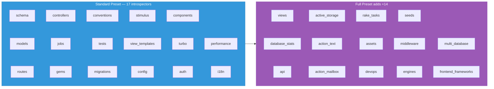

<div align="center">

# Introspectors

**31 modules that extract structured data from your Rails application.**

[Architecture](ARCHITECTURE.md) · [Configuration](CONFIGURATION.md) · [Tools Reference](TOOLS.md) · [Security](SECURITY.md)

</div>

---

## How introspectors work

Each introspector:

1. Examines a specific aspect of your Rails app (schema, models, routes, etc.)
2. Returns a Hash with structured data (never raises — wraps errors in `{ error: msg }`)
3. Results are cached with TTL + SHA256 fingerprint invalidation
4. Runs as part of a preset (`:standard` or `:full`) or can be configured individually

## Presets

### `:full` (default) — all 31 introspectors

Best for comprehensive AI context. Covers every aspect of your app.

### `:standard` — 17 introspectors

Lightweight subset for faster generation:

```
schema, models, routes, jobs, gems, conventions, controllers,
tests, migrations, stimulus, view_templates, config, components,
turbo, auth, performance, i18n
```

### Preset comparison



### Custom list

```ruby
RailsAiContext.configure do |config|
  config.introspectors = %i[schema models routes controllers views]
end
```

---

## All 31 introspectors

### Core

| Introspector | Key | What it extracts |
|:-------------|:----|:-----------------|
| SchemaIntrospector | `:schema` | Database tables, columns, types, indexes, defaults, encrypted hints |
| ModelIntrospector | `:models` | Associations, validations, scopes, enums, concerns (AST-based) |
| RouteIntrospector | `:routes` | Routes with helpers, HTTP methods, constraints |
| ControllerIntrospector | `:controllers` | Actions, filters, strong params, render paths |
| ViewIntrospector | `:views` | View files, layouts, partials |
| ViewTemplateIntrospector | `:view_templates` | Template content with ivars, Turbo frames, Stimulus refs |

### Models & Data

| Introspector | Key | What it extracts |
|:-------------|:----|:-----------------|
| SourceIntrospector | `:source` | Prism AST: associations, validations, scopes, enums, callbacks, macros, methods |
| MigrationIntrospector | `:migrations` | Migration files, versions, reversibility |
| SeedsIntrospector | `:seeds` | Seed file analysis |
| DatabaseStatsIntrospector | `:database_stats` | Table sizes, row counts, index stats |
| MultiDatabaseIntrospector | `:multi_database` | Multi-database configuration |

### Frontend

| Introspector | Key | What it extracts |
|:-------------|:----|:-----------------|
| StimulusIntrospector | `:stimulus` | Controllers, targets, values, actions |
| TurboIntrospector | `:turbo` | Turbo Frames, Streams, broadcasts |
| AssetPipelineIntrospector | `:assets` | Asset pipeline configuration, manifests |
| FrontendFrameworkIntrospector | `:frontend_frameworks` | React/Vue/Svelte/Angular detection |
| ComponentIntrospector | `:components` | ViewComponent/Phlex: props, slots, previews |

### Config & Infrastructure

| Introspector | Key | What it extracts |
|:-------------|:----|:-----------------|
| ConfigIntrospector | `:config` | Database, cache, queue, Action Cable config |
| GemIntrospector | `:gems` | Notable gems with versions and categories |
| ConventionIntrospector | `:conventions` | Auth patterns, flash messages, test patterns |
| I18nIntrospector | `:i18n` | Locale files, translation keys |
| MiddlewareIntrospector | `:middleware` | Rack middleware stack |
| EngineIntrospector | `:engines` | Mounted engines |
| DevopsIntrospector | `:devops` | Dockerfile, CI config, deployment |

### Jobs & Services

| Introspector | Key | What it extracts |
|:-------------|:----|:-----------------|
| JobIntrospector | `:jobs` | Background jobs: queue, retries, schedules |
| RakeTaskIntrospector | `:rake_tasks` | Custom rake tasks |

### Security & Auth

| Introspector | Key | What it extracts |
|:-------------|:----|:-----------------|
| AuthIntrospector | `:auth` | Authentication framework (Devise, etc.) |
| ApiIntrospector | `:api` | API configuration, versioning, serializers |

### Rails Features

| Introspector | Key | What it extracts |
|:-------------|:----|:-----------------|
| ActiveStorageIntrospector | `:active_storage` | Attachments, variants, services |
| ActionTextIntrospector | `:action_text` | Rich text attributes |
| ActionMailboxIntrospector | `:action_mailbox` | Mailbox routing rules |

### Analysis

| Introspector | Key | What it extracts |
|:-------------|:----|:-----------------|
| TestIntrospector | `:tests` | Test framework, file counts, coverage hints |
| PerformanceIntrospector | `:performance` | N+1 risks, missing indexes, counter_cache hints |

---

## AST-based introspection

The **SourceIntrospector** uses Prism AST parsing for model analysis. It runs a single-pass Dispatcher that walks the AST once and feeds events to 7 listeners simultaneously:

### 7 Prism listeners

| Listener | What it detects |
|:---------|:---------------|
| AssociationsListener | `belongs_to`, `has_many`, `has_one`, `has_and_belongs_to_many` |
| ValidationsListener | `validates`, `validates_*_of`, custom `validate :method` |
| ScopesListener | `scope :name, -> { ... }` |
| EnumsListener | Rails 7+ and legacy enum syntax, prefix/suffix options |
| CallbacksListener | All AR callback types, `after_commit` with `on:` resolution |
| MacrosListener | `encrypts`, `normalizes`, `delegate`, `has_secure_password`, `serialize`, `store`, `has_one_attached`, `has_many_attached`, `has_rich_text`, `generates_token_for`, `attribute` |
| MethodsListener | `def`/`def self.`, visibility tracking, parameter extraction, `class << self` |

### Confidence tagging

Every AST result carries a confidence tag:

- **`[VERIFIED]`** — All arguments are static literals (strings, symbols, numbers). Ground truth.
- **`[INFERRED]`** — Arguments contain dynamic expressions (variables, method calls). Requires runtime verification.

```
has_many :posts                    → [VERIFIED]
has_many :posts, class_name: name  → [INFERRED]  (name is a variable)
```

### AstCache

Thread-safe parse cache using `Concurrent::Map`:

- Keyed by: file path + SHA256 content hash + mtime
- Invalidates automatically when file changes
- Shared by all AST-based introspectors
- Cleared on `reset_all_caches!` (triggered by live reload)

---

## Cache invalidation

Introspection results are cached at two levels:

1. **Introspection cache** — Full context hash, invalidated by TTL (`config.cache_ttl`, default: 60s) and fingerprint change
2. **AST cache** — Per-file parse results, invalidated by file content change (SHA256)

The **Fingerprinter** computes a composite SHA256 from all watched directories (`app/`, `config/`, `db/`, `lib/tasks/`, `Gemfile.lock`). When the fingerprint changes, the introspection cache is invalidated even if TTL hasn't expired.

**Live Reload** watches these directories and calls `reset_all_caches!` when changes are detected, then notifies connected MCP clients via `notify_resources_list_changed`.

---

<div align="center">

**[← Architecture](ARCHITECTURE.md)** · **[Security →](SECURITY.md)**

[Back to Home](index.md)

</div>
