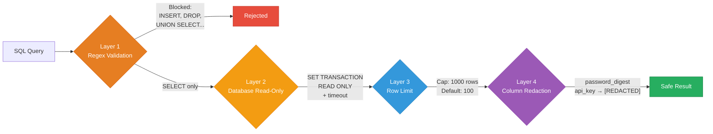

<div align="center">

# Security Model

**Read-only by design. Defense in depth. Every tool is non-destructive.**

[Architecture](ARCHITECTURE.md) · [Configuration](CONFIGURATION.md) · [Tools Reference](TOOLS.md) · [FAQ](FAQ.md)

</div>

---

> [!CAUTION]
> This gem is designed for **development environments**. The query tool is disabled in production by default. Sensitive files are blocked. All 38 tools are read-only.

## Design principles

1. **Read-only by design** — All 38 tools are annotated as non-destructive in the MCP protocol
2. **Defense in depth** — Multiple security layers, not single points of failure
3. **Sensitive data blocking** — Configurable patterns prevent access to secrets
4. **Offline by default** — No network calls except optional `rails_search_docs` with `fetch: true`
5. **Graceful degradation** — Missing optional dependencies don't expose errors or state

---

## SQL query safety (4 layers)

The `rails_query` tool uses a 4-layer security model:



### Layer 1 — SQL validation (regex-based)

Before any query reaches the database:

- Strips comments: block (`/* */`), line (`--`), MySQL (`#` at line start)
- **Blocks write keywords**: INSERT, UPDATE, DELETE, DROP, ALTER, TRUNCATE, CREATE, GRANT, REVOKE, SET, COPY, MERGE, REPLACE
- **Blocks lock clauses**: FOR UPDATE, FOR SHARE, FOR NO KEY UPDATE
- **Blocks dangerous SHOW**: GRANTS, PROCESSLIST, BINLOG, SLAVE, MASTER, REPLICAS
- **Blocks SELECT INTO**: prevents table creation via SELECT
- **Blocks multi-statements**: multiple semicolons
- **Blocks injection patterns**: OR 1=1, OR true, OR ''='', UNION SELECT
- **Allows only**: SELECT, WITH, SHOW, EXPLAIN, DESCRIBE, DESC

### Layer 2 — Database-level read-only

After validation, the query runs inside a transaction:

| Database | Mechanism |
|:---------|:----------|
| PostgreSQL | `SET TRANSACTION READ ONLY` + `SET LOCAL statement_timeout` |
| MySQL | `SET TRANSACTION READ ONLY` + `MAX_EXECUTION_TIME` hint |
| SQLite | `PRAGMA query_only = ON` + progress handler for timeout |

All queries execute inside a transaction, then rollback (even if they could write, they can't).

### Layer 3 — Row limit

- Default: 100 rows
- Configurable: `config.query_row_limit` (hard cap: 1000)
- Applied as `LIMIT` clause appended to query

### Layer 4 — Column redaction

Sensitive column values are replaced with `[REDACTED]`:

**Default redacted patterns:** `password_digest`, `encrypted_password`, `password_hash`, `reset_password_token`, `confirmation_token`, `unlock_token`, `otp_secret`, `session_data`, `secret_key`, `api_key`, `api_secret`, `access_token`, `refresh_token`, `jti`

Redaction matches by **name** and **suffix** — `SELECT password_digest AS pd` still redacts `pd` because the column name is tracked through the query result.

### Environment guard

> [!WARNING]
> Disabled in production by default. Only enable with `config.allow_query_in_production = true` if you understand the implications.

---

## Sensitive file blocking

The `rails_search_code` and file-reading tools block access to sensitive files:

### Default patterns

```
.env*
*.key
*.pem
credentials.yml.enc
master.key
secret_key_base
config/secrets.yml
config/credentials/*
```

### AI context file exclusions

Search also excludes generated AI context files to prevent circular references:

```
CLAUDE.md, .claude/, .mcp.json
.cursor/, .cursorrules
.github/copilot-instructions.md, .github/instructions/, .vscode/mcp.json
AGENTS.md, opencode.json
.codex/
.ai-context.json
```

### Configuration

```ruby
config.sensitive_patterns = %w[.env* *.key *.pem credentials.yml.enc]
```

---

## Path traversal protection

All file-reading operations validate paths against `Rails.root`:

```ruby
real_path = File.realpath(requested_path)
raise unless real_path.start_with?(Rails.root.to_s)
```

The VFS (`rails-ai-context://views/{path}`) applies the same protection for view template reads.

---

## Command injection prevention

Search tools use array-based command execution (never shell strings):

```ruby
# Safe: array form
Open3.capture2("rg", "--no-heading", pattern, "--", directory)

# Pattern injection prevented by -- separator
```

File type parameters accept only alphanumeric characters.

---

## Regex injection prevention

User-supplied regex patterns have a 1-second timeout:

```ruby
Regexp.new(pattern, timeout: 1)
```

Complex patterns that would cause catastrophic backtracking raise `RegexpError` instead of hanging.

---

## Safe file reading

`SafeFile.read` provides drop-in safety for all file reads:

- Size limit enforcement (`config.max_file_size`, default: 5 MB)
- Returns `nil` on any failure (no exceptions leak)
- UTF-8 encoding with invalid/undefined byte replacement
- Handles: ENOENT, EACCES, EISDIR, ENAMETOOLONG, SystemCallError

---

## Log redaction

The `rails_read_logs` tool redacts sensitive data from log output:

- Passwords and tokens
- Email addresses
- Secret values
- API keys

---

## Migration safety

The `rails_migration_advisor` tool validates input:

- Table and column names must be safe identifiers
- Warns about duplicate columns
- Warns about nonexistent tables
- Checks reversibility

---

## MCP HTTP transport

When using HTTP transport (Rack middleware or McpController):

- **Default bind**: `127.0.0.1` (localhost only — not exposed to network)
- **`auto_mount` is `false` by default** — must be explicitly enabled
- **Doctor checks** warn if `auto_mount` is true (security flag)

The McpController uses thread-safe transport initialization with mutex synchronization.

---

## Credential handling

- `rails_get_env` returns credential **keys**, never values
- Environment variable values are not exposed
- `config/credentials/*.yml.enc` is in the sensitive patterns list

---

## Reporting vulnerabilities

Email crisjosephnahine@gmail.com. Response within 48 hours.

Supported versions: 4.0.x and later (4.2.1+ includes security hardening). See the repo root `SECURITY.md` for the full policy.

---

<div align="center">

**[← Introspectors](INTROSPECTORS.md)** · **[CLI Reference →](CLI.md)**

[Back to Home](index.md)

</div>
