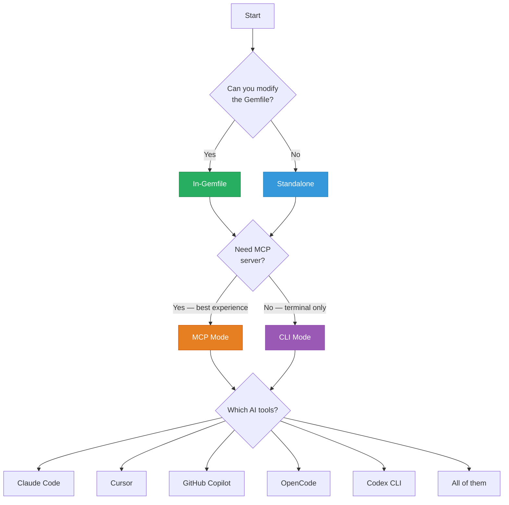

<div align="center">

# AI Tool Setup

**Per-editor setup for Claude Code, Cursor, Copilot, OpenCode, and Codex CLI.**

[Quickstart](QUICKSTART.md) · [Configuration](CONFIGURATION.md) · [Standalone](STANDALONE.md) · [Troubleshooting](TROUBLESHOOTING.md)

</div>

---

## Table of Contents

- [Which path is right for you?](#which-path-is-right-for-you)
- [Claude Code](#claude-code)
- [Cursor](#cursor)
- [GitHub Copilot](#github-copilot)
- [OpenCode](#opencode)
- [Codex CLI](#codex-cli)
- [Verify MCP is connected](#verify-mcp-is-connected)
- [HTTP Transport](#http-transport-alternative)
- [Regenerating context files](#regenerating-context-files)

---

## Which path is right for you?



## Claude Code

### Auto-setup (recommended)

```bash
rails generate rails_ai_context:install  # Select "Claude Code"
```

This creates:
- `.mcp.json` — MCP auto-discovery config (auto-detected on project open)
- `CLAUDE.md` — Root context file
- `.claude/rules/rails-schema.md` — Schema rules (loaded when editing `db/` files)
- `.claude/rules/rails-models.md` — Model rules (loaded when editing `app/models/`)
- `.claude/rules/rails-context.md` — General context rules (always loaded)
- `.claude/rules/rails-mcp-tools.md` — Tool reference (always loaded)

### Manual MCP config

If you need to configure manually, create `.mcp.json`:

```json
{
  "mcpServers": {
    "rails-ai-context": {
      "command": "bundle",
      "args": ["exec", "rails", "ai:serve"]
    }
  }
}
```

### Split rules with `paths:` frontmatter

Claude Code loads `.claude/rules/` files conditionally based on YAML frontmatter:

```yaml
---
paths:
  - db/**
  - app/models/**
---
```

Schema and model rules use this to only load when relevant files are being edited.

---

## Cursor

### Auto-setup (recommended)

```bash
rails generate rails_ai_context:install  # Select "Cursor"
```

This creates:
- `.cursor/mcp.json` — MCP auto-discovery config
- `.cursor/rules/rails-project.mdc` — Project overview
- `.cursor/rules/rails-models.mdc` — Model rules
- `.cursor/rules/rails-controllers.mdc` — Controller rules
- `.cursor/rules/rails-mcp-tools.mdc` — Tool reference (agent-requested, Type 3)

### Manual MCP config

Create `.cursor/mcp.json`:

```json
{
  "mcpServers": {
    "rails-ai-context": {
      "command": "bundle",
      "args": ["exec", "rails", "ai:serve"]
    }
  }
}
```

### Agent-requested tool loading

The MCP tools rule uses `alwaysApply: false` with a descriptive `description:` field. Cursor's agent loads it when relevant rather than on every request:

```markdown
---
description: 38 MCP tools for Rails introspection — schema, models, routes, controllers, views
alwaysApply: false
---
```

---

## GitHub Copilot

### Auto-setup (recommended)

```bash
rails generate rails_ai_context:install  # Select "GitHub Copilot"
```

This creates:
- `.vscode/mcp.json` — MCP auto-discovery config (VS Code format)
- `.github/copilot-instructions.md` — Root instructions
- `.github/instructions/rails-models.instructions.md` — Model rules
- `.github/instructions/rails-controllers.instructions.md` — Controller rules
- `.github/instructions/rails-context.instructions.md` — Context rules
- `.github/instructions/rails-mcp-tools.instructions.md` — Tool reference

### Manual MCP config

Create `.vscode/mcp.json` (note: `servers` key, not `mcpServers`):

```json
{
  "servers": {
    "rails-ai-context": {
      "command": "bundle",
      "args": ["exec", "rails", "ai:serve"]
    }
  }
}
```

### Frontmatter for agent discovery

Copilot instruction files include `name:` and `description:` YAML frontmatter:

```markdown
---
name: Rails Models
description: Model associations, validations, and schema for this Rails app
---
```

---

## OpenCode

### Auto-setup (recommended)

```bash
rails generate rails_ai_context:install  # Select "OpenCode"
```

This creates:
- `opencode.json` — MCP auto-discovery config
- `AGENTS.md` — Root context file
- `app/models/AGENTS.md` — Model-level rules
- `app/controllers/AGENTS.md` — Controller-level rules

### Manual MCP config

Create `opencode.json`:

```json
{
  "mcp": {
    "rails-ai-context": {
      "type": "local",
      "command": ["bundle", "exec", "rails", "ai:serve"]
    }
  }
}
```

Note: OpenCode uses an array for the command, not a string.

---

## Codex CLI

### Auto-setup (recommended)

```bash
rails generate rails_ai_context:install  # Select "Codex CLI"
```

This creates:
- `.codex/config.toml` — MCP config (TOML format) with Ruby environment snapshot
- Shares `AGENTS.md` and OpenCode rules files

### Manual MCP config

Create `.codex/config.toml`:

```toml
[mcp_servers.rails-ai-context]
command = "bundle"
args = ["exec", "rails", "ai:serve"]

[mcp_servers.rails-ai-context.env]
PATH = "/Users/you/.rbenv/shims:/usr/local/bin:/usr/bin"
GEM_HOME = "/Users/you/.rbenv/versions/3.3.0/lib/ruby/gems/3.3.0"
GEM_PATH = "/Users/you/.rbenv/versions/3.3.0/lib/ruby/gems/3.3.0"
```

### Why the env section?

Codex CLI `env_clear()`s the process before spawning MCP servers. Without the env section, Ruby/Bundler can't find gems. The install generator snapshots your current Ruby environment variables automatically — works with rbenv, rvm, asdf, mise, chruby, and system Ruby.

### Checking for stale env

```bash
rails ai:doctor  # Includes check_codex_env_staleness
```

If you change Ruby versions, re-run the install generator to update the env snapshot.

---

## HTTP Transport (alternative)

Instead of stdio, you can mount the MCP server inside your Rails app:

```ruby
# config/routes.rb
mount RailsAiContext::Engine, at: "/mcp"
```

Then point your AI tool's MCP config to the HTTP endpoint instead of a command:

```json
{
  "mcpServers": {
    "rails-ai-context": {
      "url": "http://localhost:3000/mcp"
    }
  }
}
```

Benefits: inherits Rails routing, authentication, and middleware stack. No separate process needed.

---

## Verify MCP is connected

After setup, confirm your AI tool can reach the MCP server.

### Claude Code

Type in Claude Code's prompt:

```
What MCP tools do you have access to?
```

You should see `rails_get_schema`, `rails_search_code`, and the other 36 tools listed.

### Cursor

Open the command palette (`Cmd+Shift+P`) and search "MCP". You should see "rails-ai-context" listed as a connected server. Or ask the Cursor agent:

```
List your available MCP tools
```

### GitHub Copilot

In VS Code with Copilot Chat, ask:

```
@workspace What MCP servers are available?
```

### OpenCode / Codex CLI

```bash
# OpenCode: check the status bar for MCP connection indicator
# Codex: run with verbose output
codex --verbose "list your tools"
```

### All tools — CLI verification

If MCP isn't connecting, verify the server works standalone:

```bash
rails ai:doctor   # Check everything
rails ai:serve    # Should start without errors (Ctrl+C to stop)
```

---

## Regenerating context files

After configuration changes:

```bash
rails ai:context         # Regenerate for all configured tools
rails ai:context:claude  # Regenerate for Claude only
rails ai:context:cursor  # Regenerate for Cursor only
```

Or use watch mode for automatic regeneration:

```bash
rails ai:watch
```

---

<div align="center">

**[← Configuration](CONFIGURATION.md)** · **[Architecture →](ARCHITECTURE.md)**

[Back to Home](index.md)

</div>
